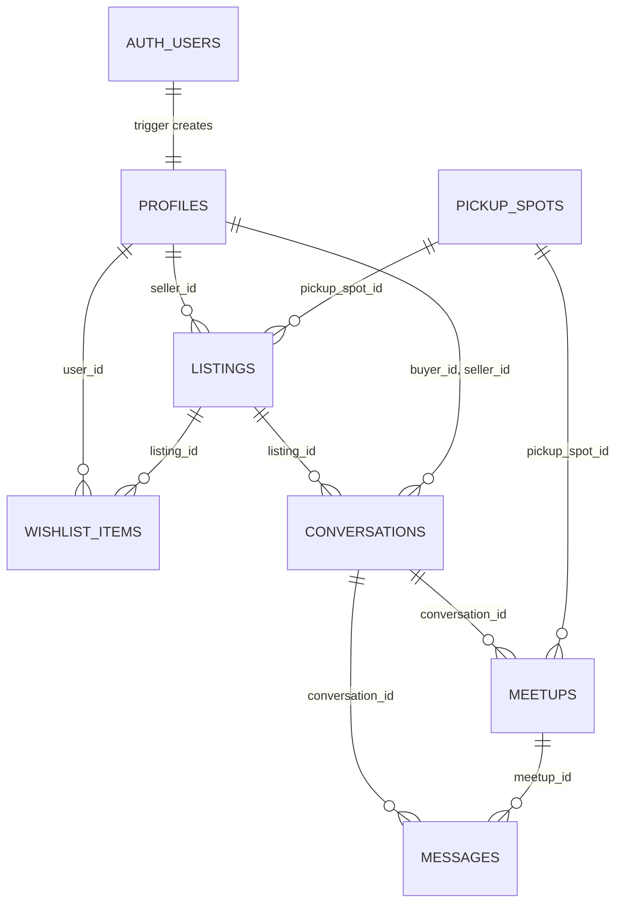

# Nitte Mart: Project Overview & Technical Approach

> AI assistance was used on this project. It is disclosed phase by phase in [`AI_USAGE.md`](../AI_USAGE.md).
>
> Anything not built or not verified is marked with a literal `TODO:` so it can be found and resolved before submission.

## 1. Project overview

Nitte Mart (called Campus Marketplace until the redesign) is a buy/sell site for students of one college. A student lists something they no longer need (a textbook, a calculator, hostel furniture), other students browse and search, and the two meet at a named pickup spot on campus. I built it for the GDG NMIT Round 2 full-stack challenge.

It is for students only, so sign-up is restricted to approved email domains and nothing can be browsed without a session.

- **Live:** <https://nmit-campus-marketplace.vercel.app>
- **Reviewer sign-in:** sign up with any address ending in `@reviewer.test` and a password of 8+ characters. No inbox is needed. `.test` is reserved by RFC 2606, so it can never collide with a real address.
- **Seeded accounts:** `seller@reviewer.test` (has listings, one sold) and `buyer@reviewer.test` (no listings). Their passwords are in the submission notes, not in this repository, because the repo is public.

**Status at the time of writing**

| Feature | Status |
| --- | --- |
| Sign-up, login, logout, domain-restricted sign-up | Built and verified |
| Browse, full-text search, filters | Built and verified |
| Listing detail with fair-price hint | Built and verified |
| My Listings | Built and verified |
| Owner-only mark-sold and delete | Built and verified |
| RLS on every table + `npm run verify:rls` | Built and verified |
| Create / edit listing with image upload | Built and verified in a real browser (30 scripted checks, see section 10) |
| ISBN lookup, barcode scan, autofill, live fair-price guide | Built and verified in a browser (section 6); TODO: try on a real phone |
| Realtime sold updates | Built and verified with two browser sessions (section 7) |
| Category-specific condition checklists | Built and verified (section 7) |
| Listing chat: realtime messages, Inbox, unread counts | Built and verified with two browser sessions (section 7) |
| Meetup booking inside the chat | Built and verified (section 7) |
| Wishlist UI, push notifications | Dropped from scope |

## 2. Tech stack and why

| Piece | Why I chose it |
| --- | --- |
| Next.js 16.4 (App Router), React 19.3 | Server Components let pages read the database directly with the user's session, so there is no separate REST layer to write and secure. Server Actions give me mutations without hand-built API routes. |
| TypeScript (strict) | The enum tuples in [`src/lib/types/listing.ts`](../src/lib/types/listing.ts) feed both the TS unions and the zod schemas, so one edit changes all three. |
| Supabase Postgres + RLS | Authorisation lives in the database, next to the data. The rule "only the seller can change a listing" is one policy, not a check repeated in every code path. |
| Supabase Auth via `@supabase/ssr` | Cookie sessions that work in Server Components, and `auth.uid()` is available inside RLS policies. |
| Supabase Storage | Same auth token and the same policy language as the tables, so image ownership is enforced the same way as row ownership. |
| zod 4 | One schema used by the form and by the Server Action. |
| Tailwind CSS 4 | Fast to style without a component library. [`DESIGN.md`](../DESIGN.md) is the design reference, applied to every page (section 8). |
| Vercel | Native Next.js hosting; pushes to `main` deploy automatically. |

## 3. Database schema

Defined in [`supabase/migrations/0001_schema.sql`](../supabase/migrations/0001_schema.sql). All migrations are written to be re-runnable.

**Enums.** `listing_category` (books, electronics, furniture, hostel, notes, other), `item_condition` (new, like_new, good, fair, poor), `listing_status` (available, sold). I used enums so the database rejects a typo instead of storing it.

### `profiles`

| Column | Type | Notes |
| --- | --- | --- |
| `id` | uuid PK | FK to `auth.users(id)`, cascade |
| `full_name` | text | not null, default `''` |
| `created_at` | timestamptz | default `now()` |

`auth.users` is not readable by the app, so the seller's display name needs a row the app can select.

### `listings`

| Column | Type | Constraint / notes |
| --- | --- | --- |
| `id` | uuid PK | `gen_random_uuid()` |
| `seller_id` | uuid | FK to `profiles`, cascade |
| `title` | text | trimmed length 3 to 120 |
| `description` | text | trimmed length 10 to 2000 |
| `price` | numeric(10,2) | 0 to 1,000,000 |
| `category`, `condition`, `status` | enums | `status` defaults to `available` |
| `image_path` | text null | bucket-relative path, not a URL |
| `pickup_spot_id` | uuid null | FK to `pickup_spots`, set null on delete |
| `course_code` | text null | `^[A-Za-z0-9]{2,12}$` |
| `semester` | smallint null | 1 to 8 |
| `isbn` | text null | `^[0-9Xx-]{10,17}$` |
| `book_author` | text null | |
| `original_price` | numeric(10,2) null | `>= 0`; baseline for the fair-price hint |
| `sold_at` | timestamptz null | set by trigger only |
| `created_at`, `updated_at` | timestamptz | `updated_at` set by trigger |
| `search_vector` | tsvector | generated, stored |

`search_vector` is a generated column: title and course code at weight A, author at B, description at C. Because it is generated, a row cannot be updated without its search index being updated too. I store the image path rather than a URL so that moving bucket or project means changing one function ([`listingImageUrl`](../src/lib/storage.ts)), not rewriting rows.

**Indexes:** GIN on `search_vector`; `(status, created_at desc)` for the default browse query; single-column indexes on `seller_id`, `category`, `pickup_spot_id`, `course_code`, `semester`.

### Other tables

| Table | Key columns | Notes |
| --- | --- | --- |
| `pickup_spots` | `id`, `name` (unique), `description`, `sort_order` | Lookup table rather than an enum because spots are campus data that can change. Seeded with seven spots. |
| `wishlist_items` | `(user_id, listing_id)` composite PK | The key itself prevents duplicate saves. **No UI.** |
| `conversations` | `listing_id`, `buyer_id`, `seller_id`, a last-read time per side | One per (listing, buyer). `seller_id` is copied from the listing by a trigger. `buyer_id <> seller_id`. |
| `messages` | `conversation_id`, `sender_id`, `kind`, `meetup_id`, `body` (1 to 1000 chars) | Typed messages and meetup events in one ordered list. Never updated or deleted. |
| `meetups` | `conversation_id`, `proposed_by`, `pickup_spot_id`, `meet_at`, `status` | At most one `proposed` or `accepted` per conversation (partial unique index). |
| `signup_allowed_domains` | `domain` PK, `note` | Read only by the sign-up hook. |

`wishlist_items` was designed up front and then dropped from scope. The table and its policies still exist; the seed script inserts one row and the verify script checks wishlist privacy, but there is no page for it. The original `inquiries` table was replaced by the three chat tables in migration 0008 (section 7 explains why it could not be adapted).

**Triggers**

- `on_auth_user_created` (after insert on `auth.users`) creates the `profiles` row, taking `full_name` from sign-up metadata. It is `security definer` with an empty `search_path`, which is why every name inside it is schema-qualified.
- `listings_set_updated_at` (before update) sets `updated_at`, and sets or clears `sold_at` from the status transition. The client never sends `sold_at`, so a sale cannot be back-dated.

## 4. Backend architecture

**Request flow**

1. [`src/proxy.ts`](../src/proxy.ts) runs first on every non-static request. It builds a Supabase client from the request cookies, calls `getClaims()` (which also refreshes an expiring token and writes the new cookies to the response), then redirects signed-out users away from anything except `/`, `/login`, `/signup`, and signed-in users away from the auth pages.
2. Server Components read data through [`createSupabaseServerClient()`](../src/lib/supabase/server.ts), which is created per request from that request's cookies. Every query therefore runs as the signed-in user and is filtered by RLS.
3. Mutations are Server Actions in [`src/app/(auth)/actions.ts`](<../src/app/(auth)/actions.ts>) and [`src/app/listings/actions.ts`](../src/app/listings/actions.ts). Each re-reads the session, validates, writes, then calls `revalidatePath` for the affected pages.

**Data-access layer.** Pages do not call Supabase directly. [`src/lib/auth.ts`](../src/lib/auth.ts) exposes `getSessionUser` / `requireSessionUser`, which return only `{ id, email }` so a raw token cannot leak into a prop. [`src/lib/listings.ts`](../src/lib/listings.ts) holds the read queries (`listListings`, `getListing`, `getMyListings`, `getPickupSpots`). Both files import `server-only`. `requireSessionUser` repeats the proxy's check on purpose: a page stays protected even if the proxy matcher is changed later.

**Validation.** Schemas live in [`src/lib/validation/`](../src/lib/validation/). The client form runs them for immediate feedback; the Server Action runs the same schema again, and that second pass is the real gate because a request can be written by hand. Each listing rule mirrors a database `CHECK`, so there are three levels and the database has the final say. URL filters are validated separately in [`src/lib/listing-filters.ts`](../src/lib/listing-filters.ts): an unrecognised value is dropped, so `?category=nonsense` gives an unfiltered page instead of a 500 from an enum cast.

**Search and filters.** `listListings` uses `textSearch` on `search_vector` with the `websearch` parser, which accepts arbitrary user text without throwing on punctuation. Filters are category, condition, pickup spot, semester, course code (case-insensitive) and "include sold". Results are capped at 60, newest first. TODO: there is no pagination.

**Fair-price hint.** [`src/lib/pricing.ts`](../src/lib/pricing.ts) multiplies `original_price` by a per-condition factor (0.9 for new down to 0.3 for poor) and labels the asking price below, in line with, or above that figure with a 15% band either side. It returns nothing when there is no original price, because a confident number built on missing data is worse than no hint. The factors are my own heuristic, not derived from data.

**Images.** The browser uploads the file straight to the `listing-images` bucket at `<uid>/<random-uuid>.<ext>`, then sends only the resulting path to the Server Action. The action accepts the path only if its folder equals the caller's uid and the filename matches the pattern the app generates, otherwise a user could point their listing at someone else's object. The bucket itself enforces a 5 MB limit and JPEG/PNG/WebP only. On edit or delete the old object is removed on a best-effort basis.

## 5. Security model

**RLS by table** ([`0002_rls.sql`](../supabase/migrations/0002_rls.sql)). RLS is enabled on every table. The `anon` role has all privileges revoked, and `authenticated` is granted only the verbs listed.

| Table | Select | Insert | Update | Delete |
| --- | --- | --- | --- | --- |
| `profiles` | any signed-in user | none (trigger) | own row | none (cascade) |
| `listings` | any signed-in user | `seller_id = auth.uid()` | own, `using` and `with check` | own |
| `pickup_spots` | any signed-in user | none | none | none |
| `wishlist_items` | own rows | own | none | own |
| `conversations` | its buyer and seller | none (database function) | none (database function) | none (cascade) |
| `messages` | the conversation's buyer and seller | own, plain text, `conversation_id` and `body` columns only | none | none |
| `meetups` | the conversation's buyer and seller | none (database function) | none (database function) | none |
| `signup_allowed_domains` | none | none | none | none |

The `with check` on the listings update policy is what stops an owner reassigning `seller_id`. Policies use `(select auth.uid())` so Postgres evaluates it once per statement instead of once per row.

**Three layers on owner-only actions.** (1) The detail page renders the controls only when `listing.seller_id === user.id`. (2) The Server Action re-reads the session and adds `.eq("seller_id", user.id)` to the query. (3) RLS refuses the row regardless. Layer 1 is convenience. I kept layer 2 even though layer 3 exists, because otherwise the only thing protecting other users' rows is that the policy is correct today and after every future migration.

**No service-role key.** The app, the seed script and the verify script all use only the publishable key. If server code could bypass RLS, then RLS would no longer be what protects the data; the correctness of every code path would be. It also means a successful seed run is evidence that the policies allow what they should.

**Sign-up domain gate** ([`0004_signup_domain_allowlist.sql`](../supabase/migrations/0004_signup_domain_allowlist.sql)). A Supabase "Before User Created" hook calls a Postgres function that looks the email's domain up in `signup_allowed_domains` and returns a 403 if it is absent. I put this in the database because the publishable key lets anyone POST to `/auth/v1/signup` directly; a check in a Server Action would be skipped by one hand-written request. The zod check in the form only exists to explain the rule early. `execute` on the function is granted to `supabase_auth_admin` only, so clients cannot call it to probe which domains are allowed. The hook has to be switched on in the dashboard; the migration alone does not activate it.

**Open-redirect protection.** [`src/lib/navigation.ts`](../src/lib/navigation.ts) accepts a `?next=` value only if it starts with a single `/` and contains no backslash, which rejects `https://evil.example`, `//evil.example` and `/\evil.example`. It is checked when the login page renders the hidden input and again in the action before redirecting.

**Storage** ([`0003_storage.sql`](../supabase/migrations/0003_storage.sql)). The bucket is public-read because listing photos are not sensitive. Insert, update and delete policies all require the first path segment to equal `auth.uid()`. The path is the ownership record, so there is no separate metadata that could disagree with it.

**What `npm run verify:rls` asserts** ([`scripts/verify-rls.mjs`](../scripts/verify-rls.mjs)). It signs in as the buyer and seller and calls the public API directly, skipping the UI:

1. A demo password that was once committed to this repo and has since been rotated no longer signs in.
2. The buyer cannot change the price of the seller's listing.
3. The buyer cannot mark it sold.
4. The buyer cannot delete it.
5. The seller cannot reassign `seller_id` to the buyer.
6. The seller cannot read the buyer's wishlist.
7. A signed-in user cannot read `signup_allowed_domains`.
8. A signed-out client cannot read listings.
9. The target listing's price, status and seller are unchanged afterwards.

Seven of the nine are access-control checks; 1 is a credential-hygiene check and 9 confirms the others had no effect. Three more, added with the condition checklists, insert the seller's own rows with a bad checklist or a photo path in another user's folder.

**Chat adds 24 assertions**, bringing the total to 36. A third account, in no conversation, tries to read the buyer and seller's conversation, its messages and its meetups; to find it in its own inbox; to post in it; to propose a meetup in it; and to mark it read. The participants then try to cheat: posting as the other person, posting a fake "meetup accepted" event, editing and deleting a sent message, sending 1001 characters and a whitespace-only message, starting a conversation about their own listing, inserting a conversation or an accepted meetup directly, changing a meetup's status directly, proposing a time in the past, at 3 am and a year away, and accepting their own proposal. The last one counts the messages again to confirm nothing was written. Where a database function does the refusing, the script checks the reason it gave, so a refusal for the wrong reason is a failure.

## 6. External API integration: Google Books, with an Open Library fallback

**What it does.** When a seller chooses the Books category, the form offers an ISBN field and, where the device has a camera, a barcode scanner. The ISBN goes to a Server Action, which looks the book up and returns title, author, a description, a cover and (when available) the list price. Empty fields are filled in; anything the seller has already typed is left alone, and every filled field stays an ordinary editable input.

**Why two sources.** I planned to use Google Books alone. When I tested it with a valid API key, its `isbn:` search returned zero results for all twelve well-known print ISBNs I tried, including *Clean Code*, CLRS and K&R, while a title search on the same key worked. Without a key it does not work at all: Google answers `429 RESOURCE_EXHAUSTED`. Open Library resolved the same ISBNs. So [`src/lib/books.ts`](../src/lib/books.ts) tries Google Books first and falls back to Open Library when Google has no match or is unavailable. With Google alone the feature would have said "not found" for nearly every textbook, and I would not have known without testing real ISBNs.

| | Google Books | Open Library |
| --- | --- | --- |
| Needs a key | Yes, in practice | No |
| Title, author, cover | Yes | Yes |
| Description | Often | Rarely |
| List price | Sometimes | Never |
| Role here | Tried first; the only source of a price | Fallback |

**What that means for the fair-price hint.** Only Google can supply a price, and only an INR price is used: a dollar figure in a field labelled in rupees would be wrong, and converting it would be a guess. When no price comes back, which is the common case today, the seller types the original price (the MRP printed on the back of most Indian books) into an optional field. The hint is computed from that field however it was filled, so it works for every category, not only books.

**How it is built**

- The API key is read only inside `books.ts`, which imports `server-only`; the browser calls [`lookupBookAction`](../src/app/listings/book-actions.ts) and never sees the key or talks to Google directly.
- The action requires a session, so anonymous callers cannot spend quota, and applies a per-user limit of 8 lookups a minute. That limit lives in server memory, so on a serverless host it is per instance and resets on a cold start. It stops loops and casual abuse, not a determined attacker.
- The ISBN check digit is validated in the browser first ([`src/lib/isbn.ts`](../src/lib/isbn.ts)), so a typo gets an instant answer and never costs a request. The same function backs the zod schema, and the listing stores the normalised ISBN.
- Responses are treated as `unknown` and every field is checked. HTML in Google descriptions is stripped. Values are truncated to the same limits the schema and database enforce, so an autofilled value can never be the reason a save is rejected.
- A Google result is used only if it actually lists the requested ISBN. `isbn:` is a search, not an exact lookup, and taking "the first result" could autofill a different book.
- When the source has no description, one is composed from catalogue facts ("Prentice Hall, July 2008, 431 pages"). Each part appears only if the source supplied it.
- **Cover.** If the seller has not added a photo, the server downloads the cover and stores it in the seller's own Storage folder, so the listing uses `image_path` exactly as for an uploaded photo. The URL fetched comes from the lookup the server just performed and is checked against a three-host allowlist; it is never an address sent by the browser.
- **Scanner.** A book's barcode is its ISBN-13 printed as an EAN-13. The scanner uses the browser's `BarcodeDetector` where it exists and can read EAN-13, otherwise a WebAssembly implementation of the same interface, loaded on demand so browsers that do not need it never download it. Barcodes outside the 978/979 book range are ignored. The camera is released when the sheet closes.
- **States.** Looking up, found (with which source), invalid ISBN, not found, rate limited, timed out, unavailable, action unreachable, camera blocked, no camera, camera in use. Every failure message ends by saying the details can be filled in by hand, and nothing blocks the form.

**Trade-offs and limits**

- The fallback WebAssembly module is fetched from a CDN at scan time, so the scanner needs a connection on browsers without a native detector.
- An imported cover is written to Storage at lookup time. If the seller abandons the form, the file is orphaned.
- Open Library data is community-edited; I saw a misspelt title ("Mathmetics") for one textbook. That is one reason every autofilled field is editable.
- TODO: confirm on a real phone. I tested the scanner with Chromium given a fake webcam showing a generated barcode, which exercises the fallback path. The native Android path and iOS Safari are untested.
- TODO: repeat one lookup on the deployed site to confirm the key is picked up on Vercel.

## 7. Realtime updates, condition checklists and the states audit

### Realtime sold updates

When a seller marks a listing sold, every open browse page and every open copy of that listing updates without a refresh.

- A small hook, [`useListingChanges`](../src/lib/use-listing-changes.ts), subscribes to changes on the `listings` table through Supabase Realtime. The table was added to the `supabase_realtime` publication in migration 0002.
- **The event is a signal, not the data.** Realtime delivers the changed row, but the hook passes on only the id and the status. Everything a page displays still comes from the server through the normal RLS-filtered queries, via `router.refresh()`. A bug in this code can make a page stale; it cannot make a page show something a query would refuse.
- **The socket carries the user's JWT.** The `anon` role has no access to `listings`, so an unauthenticated socket would connect and then silently receive nothing. `setAuth()` is called before subscribing.
- **On browse, a sold card greys out in place** ([`LiveListingGrid`](../src/components/listings/live-listing-grid.tsx)) instead of disappearing. Browse hides sold items, so a plain re-fetch would make the card someone was looking at vanish with no explanation. It leaves on the next navigation or filter change.
- Refreshes are debounced, so a burst of changes causes one re-render. The channel is removed when the component unmounts. Each page has one polite screen-reader announcement, and the visual change uses `motion-safe:` transitions so it is instant for anyone who has asked for reduced motion.

Trade-offs: every signed-in user already may read every listing, so a subscriber learns nothing a query would not tell them. I did not set `REPLICA IDENTITY FULL`, so a delete event carries only the id, which is all the page needs. A listing that sells stays visible as sold on an already-open browse page until that page next re-fetches.

### Condition checklists

A seller can tick category-specific facts about an item: for electronics, charger included, battery holds charge, screen free of scratches; for books, no highlighting, all pages intact; for lab coats, a size and no stains. The listing page shows them under "Seller confirms".

- **Every item is a positive claim.** A tick always means good news, so an unticked item can simply mean "not stated". The listing page shows those under "Not stated: ask the seller" with a dash, never a cross and never in the error colour. A cross would claim the item is bad when the seller only said nothing.
- Stored as one `jsonb` column, `condition_checks`, because the items differ by category: a column per item would be mostly empty and every new item would need a schema change.
- **Validated in three places.** The form and the Server Action use a strict zod schema built per category ([`conditionChecksSchemaFor`](../src/lib/validation/listing.ts)), so a key from another category is an error. The third is a trigger in [migration 0006](../supabase/migrations/0006_condition_checks.sql), and it is the one that matters: a signed-in user can insert their own row through the REST API directly and never run my code, and RLS allows it because it is their row. Without the trigger a crafted request could store arbitrary keys or strings. The trigger allows only the keys for that category, only `true` for a tick and only a known size, and a separate constraint caps the column at 1 KB.
- Labels are looked up in code from the stored key. No string from this column is rendered as text except a size, and only if it is one of the six known sizes.
- The same migration adds two constraints an audit found missing: a length limit on the author, and a rule that a listing's photo path must sit in its own seller's folder.

Lab coats needed a category of their own, so "Lab coats & gear" was added to the category enum.

### What the validation and states audit found

Before this phase I had an AI reviewer audit every form and page (see [`AI_USAGE.md`](../AI_USAGE.md)). The gaps were real:

| Gap | Fix |
| --- | --- |
| Mark-sold and delete **threw** on failure, sending the owner to the full-page error screen for something as ordinary as a dropped connection | They return a message shown next to the button; Delete gained a pending state |
| Route ids were checked with a pattern that only counted characters, so a URL of 36 hyphens passed, Postgres rejected it, and the page returned a 500 | A real UUID check ([`src/lib/uuid.ts`](../src/lib/uuid.ts)) everywhere an id is read |
| No `not-found` page, so a bad URL showed the framework's bare 404 | A site-wide one, and a listing-specific "This listing is gone" page |
| No boundary for an error in the root layout itself | `global-error.tsx` |
| Detail and My Listings inherited a browse skeleton that matched neither | Each has its own, shaped like its page |
| The search query was unbounded | Capped at 100 characters |
| Sign-up could show a raw internal error message | Only 4xx messages, which are written for the user, are passed through |
| The price rule rejected valid prices such as 19.99 (floating-point rounding) | Decimal places are counted on the text before conversion |
| A photo was optional, though the brief names it as a listing field | Required on create; an edit may replace a photo but not remove it |

### Listing chat and meetup booking

A buyer opens a private conversation from a listing ("Ask about this item"), the two exchange messages that arrive live, and either of them can propose where and when to meet. Schema and rules are in [`0008_chat_meetups.sql`](../supabase/migrations/0008_chat_meetups.sql); pages are under [`src/app/inbox/`](../src/app/inbox/).

**Why `inquiries` was replaced.** The table planned in Phase 1 held one buyer-to-seller note. It had no sender column, so a seller's reply had nowhere to go; nothing tied two rows into a thread; and its insert policy checked only `buyer_id`, so a seller could "inquire" about their own listing. I replaced it with `conversations` (one per listing and buyer), `messages` and `meetups`.

**Who can write what** is decided in the database, in three different ways:

- **Privilege.** A signed-in user may insert only the `conversation_id` and `body` columns of `messages`. The sender, the kind and the timestamp are column defaults (`auth.uid()`, `'text'`, `clock_timestamp()`), so a forged sender is refused before any policy is consulted. There is no update or delete grant: messages are permanent.
- **Policy.** Selecting a conversation, its messages or its meetups requires being its buyer or seller. Inserting a message requires the same.
- **Functions.** Conversations and meetups have no write grant at all. They change only through `start_conversation`, `propose_meetup`, `accept_meetup`, `cancel_meetup` and `mark_conversation_read`. These are `security definer`, so RLS does not apply inside them; each one therefore takes the caller from `auth.uid()`, never from an argument, and checks membership itself. I used functions because these changes cannot be written as a policy: a counter-proposal must retire the old meetup and insert the new one together, and "you cannot accept your own proposal" is a rule about who makes a transition.

**One active meetup** is a partial unique index on `conversation_id where status in ('proposed','accepted')`. `propose_meetup` locks the conversation row, so two simultaneous proposals queue and the second supersedes the first. `accept_meetup` is a single `UPDATE` whose `WHERE` holds every condition, so there is no gap between checking and changing. One function serves "Propose", "Suggest another time" and "Change".

**Time.** A meetup means campus time, but Vercel runs in UTC and a phone can be set to anything. The 8 am to 8 pm rule is a `CHECK` evaluated `at time zone 'Asia/Kolkata'`. "In the future" cannot be a `CHECK`, so it is in `propose_meetup`, along with a 60-day limit. The app sends times with an explicit `+05:30` and formats them through [`src/lib/campus-time.ts`](../src/lib/campus-time.ts), which builds strings from numeric parts so the server and the browser cannot render the same instant differently.

**Unread counts.** Each side of a conversation has a "read up to" time; a message is unread if the other person sent it after that. The marker is moved by `mark_conversation_read`, which takes no timestamp and touches only the caller's side. It is called from the browser when a thread is open and visible, not while the page renders, because a prefetched link would otherwise mark messages read.

**Realtime.** Every meetup event also inserts a message row, so only `messages` is published and one subscription covers a chat page. As with listings, the event is a signal: the page re-fetches through RLS and nothing from the event is displayed. The hook subscribes to `INSERT` only.

**Sold and deleted listings.** A sold listing refuses new conversations; existing ones stay open, because the two people may still be arranging the handover. Deleting a listing deletes its conversations by cascade, and the delete prompt now says so.

**A bug the test script found.** The first version of the message length rule was `char_length(btrim(body)) >= 1`. `btrim` strips spaces but not newlines, so a message of spaces around a newline passed and was stored as an empty bubble. `verify:rls` caught it on its first run against the live database, after I had already applied the migration. The rule is now `body ~ '\S'`.

Limits I know about:

- A thread loads its latest 200 messages; there is no way to page further back.
- There is no rate limit on messages, no block or report, and no notification outside the app.
- A meetup does not reserve the item. A seller can accept meetups with several buyers.
- Supabase sends Realtime `DELETE` events to every subscriber of a table, because a deleted row cannot be checked against a policy. They carry only the primary key. Deleting a listing therefore reveals the ids of its messages, and nothing else, to anyone subscribed.
- An accepted meetup is not cleared once its time has passed.

### Six kinds of post in one model

The marketplace started as buy and sell. It now also handles renting, giving away, found items, skills on offer and calls for teammates ([`0010_listing_types.sql`](../supabase/migrations/0010_listing_types.sql)).

**One table, not six.** A rental or a team request needs what a sale already has: an owner, a title, a description, an optional photo, search, a status and a chat. Six tables would have meant six sets of policies to get right and keep right. So `listings` gained a `type` column and the few fields only one kind uses (`rent_max_days`, `found_on`, `event_name`, `event_date`, `tags`). The existing policies, the chat and the photo rules apply to all six without change.

**The rules per type are CHECK constraints**, because a signed-in user can insert their own row through the API without running any of my code. A free post must have price 0; a rental must say how many days, from 1 to 30; a found-on date is allowed only on a found item; tags are allowed only on skill and team posts, at most 8, lower-case, in a fixed character set. The Server Action and the form apply the same rules first so the user gets a message next to the field.

**The status column was not extended.** "Sold" already means "finished, stop offering this". A rental that is out, a found item that was claimed and a team that is full are the same state with different names. The app shows a label per type over the one stored value, and every older rule that reads `status` (browse filters, the `sold_at` trigger, the chat function that refuses new conversations on a finished post) was already correct for all six. Adding enum values would have meant revisiting each of them.

**Who can mark a rental returned or a found item claimed?** Its owner, and nobody else, because it is an update of `status` and the update policy from the first migration already says owner only. A stranger cannot "claim" a found item in the database; they say so in chat and the person who posted it decides.

**A post cannot change type.** Without that, an owner could turn a FREE post people had replied to into a sale. A trigger refuses it, and the edit action takes the type from the stored row, not from the form.

**The buttons do one thing.** "Rent it", "Claim it", "I'm in" and "Hire" each open a chat with a suggested first message. Nothing is booked, reserved or paid for on the site, and the page says so under the button.

**Deploying it without breaking the live site.** The local and live sites share one database, so the migration had to be safe to run before the new code was pushed. It only adds columns with defaults (`type` defaults to `sale`) and keeps every function signature. The one thing it could not prevent: until the new code was live, non-sale posts made during testing appeared on the deployed browse page as 0-rupee sales.

**Lost and found** carries a note wherever it appears that it is posted by students and is not the college's official desk, and the form suggests holding one detail back so the real owner can prove the item is theirs.

Limits I know about: there are no rental dates or availability, only a maximum length; a found item is "claimed" on the poster's word; tags are free text, so `js` and `javascript` are different tags; and search does not look inside tags, which are filtered separately.

### Profiles, Squad up and the chat additions

**Profiles** ([`/u/[id]`](../src/app/u/[id]/page.tsx)) show a name, a short bio, skills, a photo and open posts to signed-in students. Editing is limited three times over: the row is chosen by the session, a column-level grant allows only the five editable columns, and each has a CHECK. The GitHub link is built from a stored username that may only contain the characters GitHub allows, so there is no stored URL that could be a `javascript:` link.

**Squad up** needed no new mechanism: a skill on offer and a call for teammates are two of the six post types, filtered by tag, and answered through the same chat.

**Quick replies** fill the message box and do not send, so "Would you do ₹X?" can have its X typed in and nothing goes out by a slip of the thumb.

**The typing indicator** is a Realtime broadcast between the two browsers; nothing is stored. I want to be exact about its limit: the channel is named after the conversation and is not access-controlled, so someone who knew a conversation's id could learn that somebody is typing, or make the indicator blink. They could not read or send a message, because messages go through the database and its policies. Closing that gap needs a Realtime authorisation policy, which I have not written.

## 8. Design

The first design pass followed an Airbnb-derived reference: white canvas, one red accent. It was competent and looked like a great many other sites. The second pass replaced it with the project's own system, written up in [`DESIGN.md`](../DESIGN.md): dark-first, a near-black canvas, deep indigo, one warm yellow accent, and tall condensed title-card headlines (Anton) over photographs. NITTE sounds like "night", so the product is the campus after dark, and it was renamed Nitte Mart to match.

**One token system, two themes.** Every colour is a CSS variable in [`globals.css`](../src/app/globals.css), exposed to Tailwind, so components say `bg-canvas` and never a hex. The dark values are the defaults and the light theme is an override block. No component has a `dark:` variant.

**Dark is the default for everyone.** The theme is a `data-theme` attribute on `<html>`, chosen with a toggle and stored in a cookie that `layout.tsx` reads on the server, so the first paint is already right. I chose to ignore the operating system's setting: a reviewer on a light-mode laptop would otherwise never see the design as intended. The cost is that someone who prefers light has to press the toggle once.

**Contrast decisions**

| Problem | What I did |
| --- | --- |
| Yellow text on the cream light canvas is about 1.4:1 | Yellow is a fill only on light. The price has its own token: yellow on dark, ink on light. |
| A yellow button on cream has almost no edge | On the light theme yellow buttons get a 1.5 px ink outline. |
| White text on yellow is unreadable | Text on yellow is always the near-black `on-accent` (13.9:1). |
| Faint input borders | Inputs use `control-border` (4.8:1 dark, 3.4:1 light); hairlines are for decoration only. |

**Sold listings** are still marked four ways, only one of which is colour: a tilted SOLD stamp over the photo, the word "Sold" beside the price, the price struck through, and the photo desaturated. The card's accessible name begins "Sold:".

**The fair-price verdict** uses a word and a shape (▼ below, ● in line, ▲ above), not red and green.

**The home page is five scenes**, one idea each: the hero with search, the ISBN scanner, meeting on campus, who can get in, and what is for sale now.

- **Every number on it is read, not written.** The page is public and a signed-out visitor can read no table, so three narrow database functions ([`0009_public_stats.sql`](../supabase/migrations/0009_public_stats.sql)) return counts, pickup spot names and card-only listing teasers. The "security tests passed" figure comes from a file that `npm run verify:rls` writes when it runs. If a source cannot be read, that part of the page is left out; nothing falls back to a made-up value.
- The numbers are small because the project is new. They are shown as they are.
- The headline says "Locked to NITTE". The exact rule (an `@nmit.ac.in` address, plus `@reviewer.test` for assessors, with email confirmation off for the demo) is stated on the [`/security`](../src/app/security/page.tsx) page, which also explains each group of access-control tests in plain language.

**Motion.** Scroll reveals, digit rollers, a SOLD stamp that wipes in and a short scanner illustration.

- Content is visible by default. One `IntersectionObserver` hides what is below the fold and reveals it on arrival, so with JavaScript off or slow nothing is missing. There are no scroll listeners.
- All of it is inside `prefers-reduced-motion: no-preference`. With reduced motion every scene shows its final frame.
- The scanner illustration plays once and stops. Only the hero moves continuously, so only it needs the pause button it already had.
- Parallax is applied only where the browser supports scroll-driven animations natively.

**Hero.** The photographs are graded in CSS (darkened, slightly desaturated, an indigo multiply layer and still film grain), so any photo sits inside the palette. The image list is read from `public/hero/` at **build** time, because on Vercel `public/` is not on the server function's filesystem. The three images there now are generated placeholders. TODO: replace them with real campus photographs ([instructions](../public/hero/README.md)).

**Voice.** Empty states, errors and the 404 are cheeky, and each still says what to do next. Destructive confirmations and screen-reader-only text are plain.

**Not finished:** the logo is undecided, so the header is a text wordmark and the favicon is the letters NM.

I checked the new code against Vercel's Web Interface Guidelines with the `web-design-guidelines` skill. It led to four changes: typographic apostrophes in visible copy; the reveal script now measures every element before changing any, instead of alternating; a bottom scroll margin so the phone's sticky action bar cannot cover a focused element; and hover states on the footer links. One finding I left as it is: the SOLD stamp animates `clip-path`, which is not one of the two properties the guideline allows, because a wipe cannot be done with `opacity` or `transform` alone and it runs once on a small element.

## 9. Key decisions and trade-offs

- **Cache Components disabled.** `create-next-app` enabled `cacheComponents` and `partialPrefetching`. With them on, reading `cookies()` outside a `<Suspense>` boundary is a build error, and `@supabase/ssr` reads cookies on every authenticated request. A marketplace where a listing can sell at any moment also wants fresh reads. I gave up Partial Prerendering; `loading.tsx` still gives streamed loading states.
- **`proxy.ts`, not `middleware.ts`.** Next 16 renamed the convention. Every Supabase guide still says `middleware.ts`; a file with that name would not run, and the only symptom would be sessions expiring because nothing refreshed the token.
- **`getClaims()` over `getUser()`.** `getClaims()` verifies the JWT signature instead of calling the auth server on every request. The cost is that it proves the token is genuine and unexpired, not that the account still exists this second. I accepted that because RLS, not this check, is the boundary on data. I never use `getSession()` for an authorisation decision since it does not verify the cookie. TODO: confirm the Supabase project uses asymmetric signing keys; with a legacy shared secret I believe `getClaims()` falls back to a network call.
- **The `setAll` headers argument.** In `@supabase/ssr` 0.12, `setAll` receives a second argument carrying `Cache-Control: private, no-store`. Dropping it risks a CDN caching a response that sets auth cookies and serving it to another user. The proxy copies those headers onto the response.
- **Deny-by-default allowlist.** Supabase's published hook example keeps an allow list and a deny list and admits an address that matches neither. I made it a pure allowlist so the failure mode is a real student refused, not a stranger admitted. The example also compares `lower(domain)` with `lower($1)`, where `domain` is shadowed by the table's column and `$1` is the whole JSON event, not the extracted domain; I used a prefixed local variable.
- **Email confirmation off for the demo.** Reviewers can sign up without an inbox. The cost is that nobody proves they own the address, so the domain gate is the only control. A real deployment should turn confirmation on and delete the `reviewer.test` row.
- **Browser-to-Storage uploads.** Server Action request bodies are capped at 1 MB by default, below a typical phone photo. Uploading from the browser avoids raising that limit and means the Storage policy authorises the write directly. The cost is that an upload can succeed and the following save fail, leaving an orphaned file.
- **Two book sources instead of one.** Google Books returned nothing for print ISBNs when I tested it, so the lookup falls back to Open Library. The cost is a second request on most lookups and no price from the fallback, which is why the original price is also a field the seller can fill in. Details in section 6.
- **A validation bug I had shipped.** The price check `Math.round(value * 100) === value * 100` rejected valid prices such as 19.99, because 19.99 * 100 is 1998.9999999999998 in floating point. A reviewer pass caught it. I now count decimal digits in the string before converting, which is what the rule actually meant.
- **Hand-written DB types.** `supabase gen types` needs an access token I chose not to hold. The types can drift from the schema, so I derive unions from const tuples and keep them in step with the migration they mirror.
- **GET-form filters.** The filter bar is a plain `<form method="get">`. State lives in the URL, so a filtered view can be shared, the back button works, and it needs no client JavaScript.
- **Checking affected row counts.** A write blocked by RLS does not raise an error; zero rows match. The actions and the verify script use `.select("id")` after the write and treat zero rows as "not allowed". Checking only `error` would report a refused write as success and make the RLS tests pass vacuously.
- **The ambiguous-embed bug.** `seller:profiles(full_name)` failed at runtime because PostgREST can reach `profiles` from `listings` three ways (directly, and through `wishlist_items` and `inquiries`). `next build` and `tsc` both passed, because the select string is opaque to them. I only found it by running the query against the real database, and fixed it by naming the constraint: `profiles!listings_seller_id_fkey`. The lesson I took is that a green build says nothing about query strings.

## 10. Testing and verification

**Verified, and how**

- `next build`, `tsc --noEmit` and `eslint` clean, re-run after the create/edit work.
- A scripted browser pass with `playwright-cli` against a local production build (`next build` + `next start`), 30 of 30 checks passing: sign-in; the Sell an item link; an empty form blocked client-side; a bad price rejected on blur; a non-image file refused; photo preview; create; the photo stored at `<uid>/<uuid>.png` and publicly fetchable; the edit form pre-filled; edit saving title, price and a replacement photo; the replaced photo removed from Storage; mark sold; the sold item hidden from default browse and shown with a Sold label when included; My Listings; a second user seeing no owner controls and a not-found page on the edit URL; delete with its confirm dialog, both cancelled and accepted; and the deleted listing and its photo both gone.
- `npm run verify:rls`: 61 of 61 assertions pass against the live database (59 before the two Squad up chat checks). Twenty were added with the six post types: a non-owner cannot close someone else's rental, giveaway, found item or team request; an owner cannot change a post's type; eight crafted inserts that break a per-type rule are rejected; a profile cannot be edited by someone else, hold a `javascript:` link, point at another user's photo or change its own creation date; and a finished post refuses a new conversation. Before that it stood at 39 of 39. Three attack the checklist and photo-path rules through the API directly, 24 attack chat and meetups (section 5), and three confirm the public home page functions return card fields and counts only. The first run with the chat checks scored 34: the two failures were a real bug in the message length rule (section 7).
- Chat and meetups, with three separate browser sessions (seller, buyer and a third user) at 390 px and 1280 px in both themes: asking about an item; messages arriving in both directions with a `window` marker surviving; the header's unread count rising on another page; proposing, counter-proposing, accepting and cancelling a meetup with the other person's page updating live; the accepted meetup shown on the listing to the two participants and not to the third user; the third user opening the conversation's URL and getting the not-found page. Five defects were found and fixed, then re-checked on a fresh build.
- Realtime: two separate browser sessions, a buyer watching and a seller acting. The buyer's browse card gained its Sold label in place, and the buyer's open listing page gained its sold banner. In both cases a marker set on `window` beforehand was still there afterwards, which shows the page had not reloaded.
- The checklist trigger: seven crafted inserts through the API (a key from another category, an unknown key, a script-like string, `false`, a bad size, a checklist on a category without one, and a photo in another user's folder) were all rejected.
- `npm run seed:demo` and `npm run reseed:demo` succeed using only the publishable key, which exercises the migrations, the domain hook, the profile trigger and the `sold_at` trigger.
- Against the live database: search by a plain word, a course code and an author name each return rows; punctuation-only input returns nothing without erroring; category filtering works.
- On the production URL: `/`, `/login`, `/signup` return 200; `/listings` and `/listings/mine` redirect to `/login?next=...` when signed out; `?next=https://evil.example` is rejected.
- On the production site I confirmed by hand that a `@reviewer.test` sign-up succeeds and a `gmail.com` sign-up is refused.

**Not verified / known limitations**

- The browser pass ran locally against the production build, not against the deployed Vercel URL. TODO: repeat the create and edit steps, and one chat with a meetup, on the live site.
- The redesign, at 390 px and 1280 px in both themes: 98 screenshots inspected; contrast measured from computed colours on every page, with nothing under 4.5:1 (lowest 5.27:1, muted text on the light soft surface); scroll reveals, with none left hidden; reduced motion, with nothing hidden or moving; the theme surviving a reload with no flash. Nine defects found, seven fixed and re-checked. The two left are a white hero search box in both themes, which is intended, and a signed-out visitor to an unknown URL being sent to sign in instead of the 404.
- Chat: a meetup time later the same day was not tried (the pass ran after 8 pm campus time), two proposals at the same instant were not tried, and Realtime not reaching a third user was observed in a browser rather than asserted by a script.
- `notFound()` pages return HTTP 200, not 404. A route with a `loading.tsx` starts streaming before the page decides it does not exist, which fixes the status code; Next adds a `noindex` tag instead. The user sees the not-found page either way. This is a cost of streamed loading states that I only noticed because a test asserted on the status code.
- An upload can succeed and the following save fail, leaving an orphaned file in Storage. The form reuses the uploaded path on retry, but nothing sweeps up after an abandoned form.
- A photo is optional when creating a listing.
- `next dev` on my Windows machine intermittently failed server-side requests to Supabase with a 10 second connect timeout while compiling. I could not reproduce it in plain Node, with `curl`, or in the production build, and did not find the cause.
- TODO: Storage policies have no automated test. `verify:rls` does not try to upload into, overwrite or delete from another user's folder.
- The wishlist check covers read privacy only.
- There are no unit, component or end-to-end tests. All verification is the scripts above plus manual checks.
- The `Cache-Control: private, no-store` header path has not been observed in production, since it only fires on a response that rotates auth cookies.
- No pagination: browse returns at most 60 listings.
- No password reset flow, and no rate limiting of my own on top of whatever Supabase applies.
- The allowed-domain list exists in two places (the database seed and the form's zod schema). If they drift, the result is a confusing message, not a security hole.
- The demo account passwords that were originally committed remain in git history and in the two scripts. They have been rotated, and the first `verify:rls` assertion checks the old seller password no longer works.
- TODO: `README.md` and `docs/architecture.md` are partly out of date (feature checklist, project structure, an "Open items" section saying the migrations have not been run). Update before submitting.

## 11. What I would do next

1. Repeat the create/edit browser pass on the deployed site.
2. Test the barcode scanner on real Android and iOS devices.
4. Extend `verify:rls` to cover Storage (cross-folder upload and delete).
5. Add pagination to browse and rank search results by relevance instead of only by date.
6. Add a small end-to-end suite for the sign-up, list, mark-sold path so regressions do not rely on manual checks.
7. Replace the placeholder hero images and demo photos with real ones.
8. Before any real use: turn email confirmation on, remove `reviewer.test` from the allowlist, and generate database types instead of hand-writing them.
9. Either build the wishlist UI or drop the unused table.
