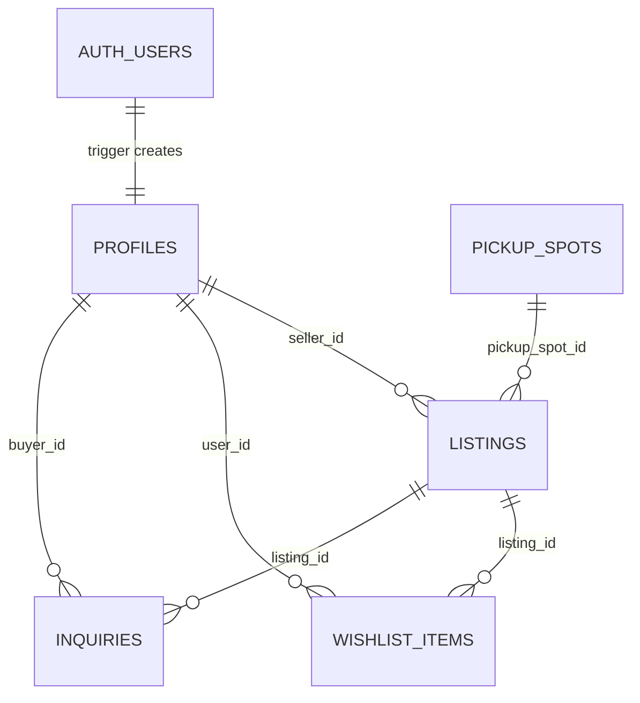

# Campus Marketplace: Project Overview & Technical Approach

> AI assistance was used on this project. It is disclosed phase by phase in [`AI_USAGE.md`](../AI_USAGE.md).
>
> Anything not built or not verified is marked with a literal `TODO:` so it can be found and resolved before submission.

## 1. Project overview

Campus Marketplace is a buy/sell site for students of one college. A student lists something they no longer need (a textbook, a calculator, hostel furniture), other students browse and search, and the two meet at a named pickup spot on campus. I built it for the GDG NMIT Round 2 full-stack challenge.

It is for students only, so sign-up is restricted to approved email domains and nothing can be browsed without a session.

- **Live:** <https://nmit-campus-marketplace.vercel.app>
- **Reviewer sign-in:** sign up with any address ending in `@reviewer.test` and a password of 8+ characters. No inbox is needed. `.test` is reserved by RFC 2606, so it can never collide with a real address.
- **Seeded accounts:** `seller@reviewer.test` (has listings, one sold) and `buyer@reviewer.test` (no listings). Their passwords are in the submission notes, not in this repository, because the repo is public.

**Status at the time of writing**

| Feature | Status |
| --- | --- |
| Sign-up, login, logout, domain-restricted sign-up | Built and verified |
| Browse, full-text search, filters | Built and verified |
| Listing detail with fair-price hint | Built and verified |
| My Listings | Built and verified |
| Owner-only mark-sold and delete | Built and verified |
| RLS on every table + `npm run verify:rls` | Built and verified |
| Create / edit listing with image upload | Built and verified in a real browser (30 scripted checks, see section 8) |
| ISBN lookup, barcode scan, autofill, live fair-price guide | Built and verified in a browser (section 6); TODO: try on a real phone |
| Realtime sold updates | TODO: not built (publication exists, no client subscription) |
| Wishlist UI, inquiry messaging, push notifications | Dropped from scope |

## 2. Tech stack and why

| Piece | Why I chose it |
| --- | --- |
| Next.js 16.4 (App Router), React 19.3 | Server Components let pages read the database directly with the user's session, so there is no separate REST layer to write and secure. Server Actions give me mutations without hand-built API routes. |
| TypeScript (strict) | The enum tuples in [`src/lib/types/listing.ts`](../src/lib/types/listing.ts) feed both the TS unions and the zod schemas, so one edit changes all three. |
| Supabase Postgres + RLS | Authorisation lives in the database, next to the data. The rule "only the seller can change a listing" is one policy, not a check repeated in every code path. |
| Supabase Auth via `@supabase/ssr` | Cookie sessions that work in Server Components, and `auth.uid()` is available inside RLS policies. |
| Supabase Storage | Same auth token and the same policy language as the tables, so image ownership is enforced the same way as row ownership. |
| zod 4 | One schema used by the form and by the Server Action. |
| Tailwind CSS 4 | Fast to style without a component library. [`DESIGN.md`](../DESIGN.md) is the design reference; so far only the create and edit pages follow it. TODO: restyle the remaining pages. |
| Vercel | Native Next.js hosting; pushes to `main` deploy automatically. |

## 3. Database schema

Defined in [`supabase/migrations/0001_schema.sql`](../supabase/migrations/0001_schema.sql). All migrations are written to be re-runnable.

**Enums.** `listing_category` (books, electronics, furniture, hostel, notes, other), `item_condition` (new, like_new, good, fair, poor), `listing_status` (available, sold). I used enums so the database rejects a typo instead of storing it.

### `profiles`

| Column | Type | Notes |
| --- | --- | --- |
| `id` | uuid PK | FK to `auth.users(id)`, cascade |
| `full_name` | text | not null, default `''` |
| `created_at` | timestamptz | default `now()` |

`auth.users` is not readable by the app, so the seller's display name needs a row the app can select.

### `listings`

| Column | Type | Constraint / notes |
| --- | --- | --- |
| `id` | uuid PK | `gen_random_uuid()` |
| `seller_id` | uuid | FK to `profiles`, cascade |
| `title` | text | trimmed length 3 to 120 |
| `description` | text | trimmed length 10 to 2000 |
| `price` | numeric(10,2) | 0 to 1,000,000 |
| `category`, `condition`, `status` | enums | `status` defaults to `available` |
| `image_path` | text null | bucket-relative path, not a URL |
| `pickup_spot_id` | uuid null | FK to `pickup_spots`, set null on delete |
| `course_code` | text null | `^[A-Za-z0-9]{2,12}$` |
| `semester` | smallint null | 1 to 8 |
| `isbn` | text null | `^[0-9Xx-]{10,17}$` |
| `book_author` | text null | |
| `original_price` | numeric(10,2) null | `>= 0`; baseline for the fair-price hint |
| `sold_at` | timestamptz null | set by trigger only |
| `created_at`, `updated_at` | timestamptz | `updated_at` set by trigger |
| `search_vector` | tsvector | generated, stored |

`search_vector` is a generated column: title and course code at weight A, author at B, description at C. Because it is generated, a row cannot be updated without its search index being updated too. I store the image path rather than a URL so that moving bucket or project means changing one function ([`listingImageUrl`](../src/lib/storage.ts)), not rewriting rows.

**Indexes:** GIN on `search_vector`; `(status, created_at desc)` for the default browse query; single-column indexes on `seller_id`, `category`, `pickup_spot_id`, `course_code`, `semester`.

### Other tables

| Table | Key columns | Notes |
| --- | --- | --- |
| `pickup_spots` | `id`, `name` (unique), `description`, `sort_order` | Lookup table rather than an enum because spots are campus data that can change. Seeded with seven spots. |
| `wishlist_items` | `(user_id, listing_id)` composite PK | The key itself prevents duplicate saves. **No UI.** |
| `inquiries` | `id`, `listing_id`, `buyer_id`, `body` (1 to 1000 chars) | **No UI.** |
| `signup_allowed_domains` | `domain` PK, `note` | Read only by the sign-up hook. |

`wishlist_items` and `inquiries` were designed up front and then dropped from scope. The tables and their policies still exist; the seed script inserts one wishlist row and the verify script checks wishlist privacy, but there is no page for either.

**Triggers**

- `on_auth_user_created` (after insert on `auth.users`) creates the `profiles` row, taking `full_name` from sign-up metadata. It is `security definer` with an empty `search_path`, which is why every name inside it is schema-qualified.
- `listings_set_updated_at` (before update) sets `updated_at`, and sets or clears `sold_at` from the status transition. The client never sends `sold_at`, so a sale cannot be back-dated.

## 4. Backend architecture

**Request flow**

1. [`src/proxy.ts`](../src/proxy.ts) runs first on every non-static request. It builds a Supabase client from the request cookies, calls `getClaims()` (which also refreshes an expiring token and writes the new cookies to the response), then redirects signed-out users away from anything except `/`, `/login`, `/signup`, and signed-in users away from the auth pages.
2. Server Components read data through [`createSupabaseServerClient()`](../src/lib/supabase/server.ts), which is created per request from that request's cookies. Every query therefore runs as the signed-in user and is filtered by RLS.
3. Mutations are Server Actions in [`src/app/(auth)/actions.ts`](<../src/app/(auth)/actions.ts>) and [`src/app/listings/actions.ts`](../src/app/listings/actions.ts). Each re-reads the session, validates, writes, then calls `revalidatePath` for the affected pages.

**Data-access layer.** Pages do not call Supabase directly. [`src/lib/auth.ts`](../src/lib/auth.ts) exposes `getSessionUser` / `requireSessionUser`, which return only `{ id, email }` so a raw token cannot leak into a prop. [`src/lib/listings.ts`](../src/lib/listings.ts) holds the read queries (`listListings`, `getListing`, `getMyListings`, `getPickupSpots`). Both files import `server-only`. `requireSessionUser` repeats the proxy's check on purpose: a page stays protected even if the proxy matcher is changed later.

**Validation.** Schemas live in [`src/lib/validation/`](../src/lib/validation/). The client form runs them for immediate feedback; the Server Action runs the same schema again, and that second pass is the real gate because a request can be written by hand. Each listing rule mirrors a database `CHECK`, so there are three levels and the database has the final say. URL filters are validated separately in [`src/lib/listing-filters.ts`](../src/lib/listing-filters.ts): an unrecognised value is dropped, so `?category=nonsense` gives an unfiltered page instead of a 500 from an enum cast.

**Search and filters.** `listListings` uses `textSearch` on `search_vector` with the `websearch` parser, which accepts arbitrary user text without throwing on punctuation. Filters are category, condition, pickup spot, semester, course code (case-insensitive) and "include sold". Results are capped at 60, newest first. TODO: there is no pagination.

**Fair-price hint.** [`src/lib/pricing.ts`](../src/lib/pricing.ts) multiplies `original_price` by a per-condition factor (0.9 for new down to 0.3 for poor) and labels the asking price below, in line with, or above that figure with a 15% band either side. It returns nothing when there is no original price, because a confident number built on missing data is worse than no hint. The factors are my own heuristic, not derived from data.

**Images.** The browser uploads the file straight to the `listing-images` bucket at `<uid>/<random-uuid>.<ext>`, then sends only the resulting path to the Server Action. The action accepts the path only if its folder equals the caller's uid and the filename matches the pattern the app generates, otherwise a user could point their listing at someone else's object. The bucket itself enforces a 5 MB limit and JPEG/PNG/WebP only. On edit or delete the old object is removed on a best-effort basis.

## 5. Security model

**RLS by table** ([`0002_rls.sql`](../supabase/migrations/0002_rls.sql)). RLS is enabled on every table. The `anon` role has all privileges revoked, and `authenticated` is granted only the verbs listed.

| Table | Select | Insert | Update | Delete |
| --- | --- | --- | --- | --- |
| `profiles` | any signed-in user | none (trigger) | own row | none (cascade) |
| `listings` | any signed-in user | `seller_id = auth.uid()` | own, `using` and `with check` | own |
| `pickup_spots` | any signed-in user | none | none | none |
| `wishlist_items` | own rows | own | none | own |
| `inquiries` | the buyer, or the listing's seller | `buyer_id = auth.uid()` | none | none |
| `signup_allowed_domains` | none | none | none | none |

The `with check` on the listings update policy is what stops an owner reassigning `seller_id`. Policies use `(select auth.uid())` so Postgres evaluates it once per statement instead of once per row.

**Three layers on owner-only actions.** (1) The detail page renders the controls only when `listing.seller_id === user.id`. (2) The Server Action re-reads the session and adds `.eq("seller_id", user.id)` to the query. (3) RLS refuses the row regardless. Layer 1 is convenience. I kept layer 2 even though layer 3 exists, because otherwise the only thing protecting other users' rows is that the policy is correct today and after every future migration.

**No service-role key.** The app, the seed script and the verify script all use only the publishable key. If server code could bypass RLS, then RLS would no longer be what protects the data; the correctness of every code path would be. It also means a successful seed run is evidence that the policies allow what they should.

**Sign-up domain gate** ([`0004_signup_domain_allowlist.sql`](../supabase/migrations/0004_signup_domain_allowlist.sql)). A Supabase "Before User Created" hook calls a Postgres function that looks the email's domain up in `signup_allowed_domains` and returns a 403 if it is absent. I put this in the database because the publishable key lets anyone POST to `/auth/v1/signup` directly; a check in a Server Action would be skipped by one hand-written request. The zod check in the form only exists to explain the rule early. `execute` on the function is granted to `supabase_auth_admin` only, so clients cannot call it to probe which domains are allowed. The hook has to be switched on in the dashboard; the migration alone does not activate it.

**Open-redirect protection.** [`src/lib/navigation.ts`](../src/lib/navigation.ts) accepts a `?next=` value only if it starts with a single `/` and contains no backslash, which rejects `https://evil.example`, `//evil.example` and `/\evil.example`. It is checked when the login page renders the hidden input and again in the action before redirecting.

**Storage** ([`0003_storage.sql`](../supabase/migrations/0003_storage.sql)). The bucket is public-read because listing photos are not sensitive. Insert, update and delete policies all require the first path segment to equal `auth.uid()`. The path is the ownership record, so there is no separate metadata that could disagree with it.

**What `npm run verify:rls` asserts** ([`scripts/verify-rls.mjs`](../scripts/verify-rls.mjs)). It signs in as the buyer and seller and calls the public API directly, skipping the UI:

1. A demo password that was once committed to this repo and has since been rotated no longer signs in.
2. The buyer cannot change the price of the seller's listing.
3. The buyer cannot mark it sold.
4. The buyer cannot delete it.
5. The seller cannot reassign `seller_id` to the buyer.
6. The seller cannot read the buyer's wishlist.
7. A signed-in user cannot read `signup_allowed_domains`.
8. A signed-out client cannot read listings.
9. The target listing's price, status and seller are unchanged afterwards.

Seven of the nine are access-control checks; 1 is a credential-hygiene check and 9 confirms the others had no effect.

## 6. External API integration: Google Books, with an Open Library fallback

**What it does.** When a seller chooses the Books category, the form offers an ISBN field and, where the device has a camera, a barcode scanner. The ISBN goes to a Server Action, which looks the book up and returns title, author, a description, a cover and (when available) the list price. Empty fields are filled in; anything the seller has already typed is left alone, and every filled field stays an ordinary editable input.

**Why two sources.** I planned to use Google Books alone. When I tested it with a valid API key, its `isbn:` search returned zero results for all twelve well-known print ISBNs I tried, including *Clean Code*, CLRS and K&R, while a title search on the same key worked. Without a key it does not work at all: Google answers `429 RESOURCE_EXHAUSTED`. Open Library resolved the same ISBNs. So [`src/lib/books.ts`](../src/lib/books.ts) tries Google Books first and falls back to Open Library when Google has no match or is unavailable. With Google alone the feature would have said "not found" for nearly every textbook, and I would not have known without testing real ISBNs.

| | Google Books | Open Library |
| --- | --- | --- |
| Needs a key | Yes, in practice | No |
| Title, author, cover | Yes | Yes |
| Description | Often | Rarely |
| List price | Sometimes | Never |
| Role here | Tried first; the only source of a price | Fallback |

**What that means for the fair-price hint.** Only Google can supply a price, and only an INR price is used: a dollar figure in a field labelled in rupees would be wrong, and converting it would be a guess. When no price comes back, which is the common case today, the seller types the original price (the MRP printed on the back of most Indian books) into an optional field. The hint is computed from that field however it was filled, so it works for every category, not only books.

**How it is built**

- The API key is read only inside `books.ts`, which imports `server-only`; the browser calls [`lookupBookAction`](../src/app/listings/book-actions.ts) and never sees the key or talks to Google directly.
- The action requires a session, so anonymous callers cannot spend quota, and applies a per-user limit of 8 lookups a minute. That limit lives in server memory, so on a serverless host it is per instance and resets on a cold start. It stops loops and casual abuse, not a determined attacker.
- The ISBN check digit is validated in the browser first ([`src/lib/isbn.ts`](../src/lib/isbn.ts)), so a typo gets an instant answer and never costs a request. The same function backs the zod schema, and the listing stores the normalised ISBN.
- Responses are treated as `unknown` and every field is checked. HTML in Google descriptions is stripped. Values are truncated to the same limits the schema and database enforce, so an autofilled value can never be the reason a save is rejected.
- A Google result is used only if it actually lists the requested ISBN. `isbn:` is a search, not an exact lookup, and taking "the first result" could autofill a different book.
- When the source has no description, one is composed from catalogue facts ("Prentice Hall, July 2008, 431 pages"). Each part appears only if the source supplied it.
- **Cover.** If the seller has not added a photo, the server downloads the cover and stores it in the seller's own Storage folder, so the listing uses `image_path` exactly as for an uploaded photo. The URL fetched comes from the lookup the server just performed and is checked against a three-host allowlist; it is never an address sent by the browser.
- **Scanner.** A book's barcode is its ISBN-13 printed as an EAN-13. The scanner uses the browser's `BarcodeDetector` where it exists and can read EAN-13, otherwise a WebAssembly implementation of the same interface, loaded on demand so browsers that do not need it never download it. Barcodes outside the 978/979 book range are ignored. The camera is released when the sheet closes.
- **States.** Looking up, found (with which source), invalid ISBN, not found, rate limited, timed out, unavailable, action unreachable, camera blocked, no camera, camera in use. Every failure message ends by saying the details can be filled in by hand, and nothing blocks the form.

**Trade-offs and limits**

- The fallback WebAssembly module is fetched from a CDN at scan time, so the scanner needs a connection on browsers without a native detector.
- An imported cover is written to Storage at lookup time. If the seller abandons the form, the file is orphaned.
- Open Library data is community-edited; I saw a misspelt title ("Mathmetics") for one textbook. That is one reason every autofilled field is editable.
- TODO: confirm on a real phone. I tested the scanner with Chromium given a fake webcam showing a generated barcode, which exercises the fallback path. The native Android path and iOS Safari are untested.
- TODO: repeat one lookup on the deployed site to confirm the key is picked up on Vercel.

## 7. Key decisions and trade-offs

- **Cache Components disabled.** `create-next-app` enabled `cacheComponents` and `partialPrefetching`. With them on, reading `cookies()` outside a `<Suspense>` boundary is a build error, and `@supabase/ssr` reads cookies on every authenticated request. A marketplace where a listing can sell at any moment also wants fresh reads. I gave up Partial Prerendering; `loading.tsx` still gives streamed loading states.
- **`proxy.ts`, not `middleware.ts`.** Next 16 renamed the convention. Every Supabase guide still says `middleware.ts`; a file with that name would not run, and the only symptom would be sessions expiring because nothing refreshed the token.
- **`getClaims()` over `getUser()`.** `getClaims()` verifies the JWT signature instead of calling the auth server on every request. The cost is that it proves the token is genuine and unexpired, not that the account still exists this second. I accepted that because RLS, not this check, is the boundary on data. I never use `getSession()` for an authorisation decision since it does not verify the cookie. TODO: confirm the Supabase project uses asymmetric signing keys; with a legacy shared secret I believe `getClaims()` falls back to a network call.
- **The `setAll` headers argument.** In `@supabase/ssr` 0.12, `setAll` receives a second argument carrying `Cache-Control: private, no-store`. Dropping it risks a CDN caching a response that sets auth cookies and serving it to another user. The proxy copies those headers onto the response.
- **Deny-by-default allowlist.** Supabase's published hook example keeps an allow list and a deny list and admits an address that matches neither. I made it a pure allowlist so the failure mode is a real student refused, not a stranger admitted. The example also compares `lower(domain)` with `lower($1)`, where `domain` is shadowed by the table's column and `$1` is the whole JSON event, not the extracted domain; I used a prefixed local variable.
- **Email confirmation off for the demo.** Reviewers can sign up without an inbox. The cost is that nobody proves they own the address, so the domain gate is the only control. A real deployment should turn confirmation on and delete the `reviewer.test` row.
- **Browser-to-Storage uploads.** Server Action request bodies are capped at 1 MB by default, below a typical phone photo. Uploading from the browser avoids raising that limit and means the Storage policy authorises the write directly. The cost is that an upload can succeed and the following save fail, leaving an orphaned file.
- **Two book sources instead of one.** Google Books returned nothing for print ISBNs when I tested it, so the lookup falls back to Open Library. The cost is a second request on most lookups and no price from the fallback, which is why the original price is also a field the seller can fill in. Details in section 6.
- **A validation bug I had shipped.** The price check `Math.round(value * 100) === value * 100` rejected valid prices such as 19.99, because 19.99 * 100 is 1998.9999999999998 in floating point. A reviewer pass caught it. I now count decimal digits in the string before converting, which is what the rule actually meant.
- **Hand-written DB types.** `supabase gen types` needs an access token I chose not to hold. The types can drift from the schema, so I derive unions from const tuples and keep them in step with the migration they mirror.
- **GET-form filters.** The filter bar is a plain `<form method="get">`. State lives in the URL, so a filtered view can be shared, the back button works, and it needs no client JavaScript.
- **Checking affected row counts.** A write blocked by RLS does not raise an error; zero rows match. The actions and the verify script use `.select("id")` after the write and treat zero rows as "not allowed". Checking only `error` would report a refused write as success and make the RLS tests pass vacuously.
- **The ambiguous-embed bug.** `seller:profiles(full_name)` failed at runtime because PostgREST can reach `profiles` from `listings` three ways (directly, and through `wishlist_items` and `inquiries`). `next build` and `tsc` both passed, because the select string is opaque to them. I only found it by running the query against the real database, and fixed it by naming the constraint: `profiles!listings_seller_id_fkey`. The lesson I took is that a green build says nothing about query strings.

## 8. Testing and verification

**Verified, and how**

- `next build`, `tsc --noEmit` and `eslint` clean, re-run after the create/edit work.
- A scripted browser pass with `playwright-cli` against a local production build (`next build` + `next start`), 30 of 30 checks passing: sign-in; the Sell an item link; an empty form blocked client-side; a bad price rejected on blur; a non-image file refused; photo preview; create; the photo stored at `<uid>/<uuid>.png` and publicly fetchable; the edit form pre-filled; edit saving title, price and a replacement photo; the replaced photo removed from Storage; mark sold; the sold item hidden from default browse and shown with a Sold label when included; My Listings; a second user seeing no owner controls and a not-found page on the edit URL; delete with its confirm dialog, both cancelled and accepted; and the deleted listing and its photo both gone.
- `npm run verify:rls`: 9 of 9 assertions pass against the live database.
- `npm run seed:demo` and `npm run reseed:demo` succeed using only the publishable key, which exercises the migrations, the domain hook, the profile trigger and the `sold_at` trigger.
- Against the live database: search by a plain word, a course code and an author name each return rows; punctuation-only input returns nothing without erroring; category filtering works.
- On the production URL: `/`, `/login`, `/signup` return 200; `/listings` and `/listings/mine` redirect to `/login?next=...` when signed out; `?next=https://evil.example` is rejected.
- On the production site I confirmed by hand that a `@reviewer.test` sign-up succeeds and a `gmail.com` sign-up is refused.

**Not verified / known limitations**

- The browser pass ran locally against the production build, not against the deployed Vercel URL. TODO: repeat the create and edit steps once on the live site.
- `notFound()` pages return HTTP 200, not 404. A route with a `loading.tsx` starts streaming before the page decides it does not exist, which fixes the status code; Next adds a `noindex` tag instead. The user sees the not-found page either way. This is a cost of streamed loading states that I only noticed because a test asserted on the status code.
- An upload can succeed and the following save fail, leaving an orphaned file in Storage. The form reuses the uploaded path on retry, but nothing sweeps up after an abandoned form.
- A photo is optional when creating a listing.
- `next dev` on my Windows machine intermittently failed server-side requests to Supabase with a 10 second connect timeout while compiling. I could not reproduce it in plain Node, with `curl`, or in the production build, and did not find the cause.
- TODO: Storage policies have no automated test. `verify:rls` does not try to upload into, overwrite or delete from another user's folder.
- TODO: `inquiries` policies are not exercised by any script, and the wishlist check covers read privacy only.
- There are no unit, component or end-to-end tests. All verification is the scripts above plus manual checks.
- The `Cache-Control: private, no-store` header path has not been observed in production, since it only fires on a response that rotates auth cookies.
- No pagination: browse returns at most 60 listings.
- No password reset flow, and no rate limiting of my own on top of whatever Supabase applies.
- The allowed-domain list exists in two places (the database seed and the form's zod schema). If they drift, the result is a confusing message, not a security hole.
- The demo account passwords that were originally committed remain in git history and in the two scripts. They have been rotated, and the first `verify:rls` assertion checks the old seller password no longer works.
- TODO: `README.md` and `docs/architecture.md` are partly out of date (feature checklist, project structure, an "Open items" section saying the migrations have not been run). Update before submitting.

## 9. What I would do next

1. Repeat the create/edit browser pass on the deployed site.
2. Test the barcode scanner on real Android and iOS devices.
3. Add the Realtime subscription on `listings` so a sold item greys out for everyone viewing it. The table is already in the `supabase_realtime` publication, so this is client work only.
4. Extend `verify:rls` to cover Storage (cross-folder upload and delete) and `inquiries`.
5. Add pagination to browse and rank search results by relevance instead of only by date.
6. Add a small end-to-end suite for the sign-up, list, mark-sold path so regressions do not rely on manual checks.
7. Apply `DESIGN.md` to the pages built before it (browse, detail, My Listings, auth).
8. Before any real use: turn email confirmation on, remove `reviewer.test` from the allowlist, and generate database types instead of hand-writing them.
9. Either build the wishlist and inquiry UIs or drop the unused tables.
