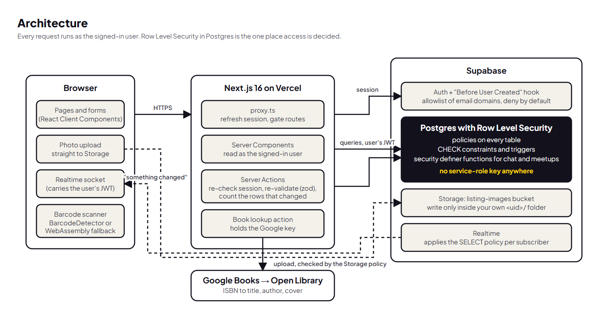
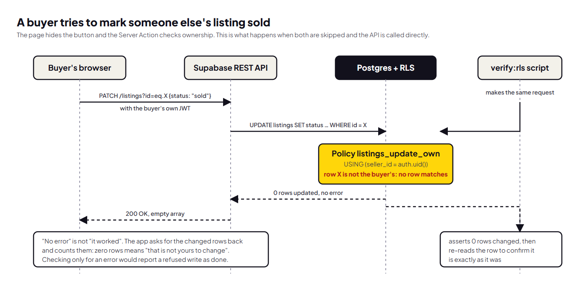
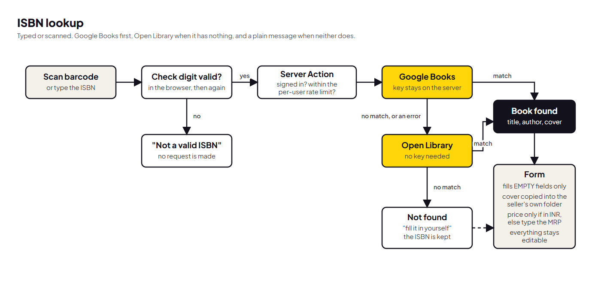

# Nitte Mart: Project Overview & Technical Approach

Live: <https://nmit-campus-marketplace.vercel.app> · Code: <https://github.com/vedantdev37/campus-marketplace>

## 1. Overview

Nitte Mart is a marketplace for one college campus. A student posts something, other students find it, and the two arrange a handover at a known spot on campus. Only campus email addresses can sign up.

A post is one of six kinds: sell, rent out, give away, a found item, a skill on offer, or a call for teammates. All six share one table, one card, one detail page, one chat and one set of access rules.

| Area | What is built |
| --- | --- |
| Accounts | Email and password sign-up, restricted to `@nmit.ac.in` by the database |
| Posts | Create, edit, close and delete, owner only; photo upload; six post types |
| Finding things | Full-text search, filters per tab, course code and semester |
| Books | ISBN typed or scanned from the barcode fills in title, author and cover |
| Pricing | A deal meter compares the asking price with the MRP |
| Chat | Private conversation per post, live messages, unread counts |
| Meetups | Propose a spot and time in chat; the other person accepts or counters |
| Live updates | Sold items, new messages and saved-item alerts appear without a refresh |
| Extras | Saved posts, profiles with skills, dark and light themes, Hinglish and Kanglish headlines |

**Stack:** Next.js 16 (App Router, Server Components, Server Actions), React 19, TypeScript, Tailwind 4, Supabase (Postgres, Auth, Row Level Security, Storage, Realtime), zod, deployed on Vercel.

## 2. Database schema

Eleven migrations in [`supabase/migrations/`](../supabase/migrations/), applied in order and written to be re-runnable.

| Table | Purpose | Notes |
| --- | --- | --- |
| `profiles` | Public face of a user | Created by a trigger on sign-up. Name, bio, skills, photo path, GitHub username |
| `listings` | Every post | `type`, title, description, price, category, condition, status, photo path, pickup spot, and a few fields used by one type only |
| `pickup_spots` | Campus handover points | A lookup table, seeded |
| `conversations` | One chat per (post, asker) | The poster's id is copied from the post by a trigger |
| `messages` | Chat messages and meetup events | Never updated or deleted |
| `meetups` | A proposed time and place | At most one active per conversation |
| `wishlist_items` | Saved posts | Primary key (user, post), so nothing is saved twice |
| `signup_allowed_domains` | Who may sign up | Read only by the sign-up hook |

Rules that must hold are in the database, not only in the app:

- **CHECK constraints** for lengths, price ranges and the rules per post type (a free post has price 0; a rental states 1 to 30 days).
- **A generated `tsvector` column** with a GIN index for search, weighted so a title or course code outranks a description.
- **Triggers** set `created_at` and `sold_at`, validate the condition checklist, and fix a post's type at creation.
- **A partial unique index** enforces one active meetup per conversation.

Photos are stored as a bucket-relative path, so the public URL is built when the page renders.

## 3. Backend architecture and security

**Reads** happen in Server Components through a Supabase client created per request, which runs every query as the signed-in user. **Writes** happen in Server Actions that re-read the session and re-validate the input with the same zod schema the form used. [`src/proxy.ts`](../src/proxy.ts) refreshes the session and redirects signed-out visitors away from everything except the home, sign-in, sign-up, security and commentary pages.

**Row Level Security is the enforcement point.** It is enabled on every table, and the project has no service-role key anywhere: not in the app, not in the seed script, not in the tests. If my server code could bypass RLS, the data would be protected by the correctness of every code path instead of by the database.

| Table | Who can read | Who can write |
| --- | --- | --- |
| `profiles` | Any signed-in user | Own row, five named columns only |
| `listings` | Any signed-in user | Own rows (`using` and `with check` on `seller_id`) |
| `conversations`, `meetups` | The two participants | Nobody directly; only through database functions |
| `messages` | The two participants | A participant may insert `conversation_id` and `body`; nothing else |
| `wishlist_items` | Own rows | Own rows |

**Three layers guard every owner-only action.** The page hides the control, the Server Action re-checks the session and scopes its query to the owner, and RLS refuses the row regardless. The diagram shows the third layer doing its job when the first two are skipped.

**Sign-up is gated in the database.** The public key lets anyone call the sign-up endpoint directly, so a domain check in my form would stop nobody. A "Before User Created" auth hook looks the email's domain up in an allowlist and refuses by default. `reviewer.test` is on the list so assessors can sign up; `.test` can never be a real domain.

**Chat writes are constrained three ways.** A column-level grant means a client cannot supply a message's sender or timestamp at all. Conversations and meetups change only through `security definer` functions that take the caller from `auth.uid()`. A proposer cannot accept their own meetup, because the acceptance is a single `UPDATE` whose `WHERE` clause excludes them.

**Realtime events are a signal, not data.** When a row changes, the page re-fetches through RLS. A bug there can make a page stale; it cannot show something a query would refuse.

**The public home page** is fed by five `security definer` functions with no arguments that return counts and card fields only, with no seller identity.

**Testing the model.** `npm run verify:rls` signs in as a non-owner and as a third user and attacks the API directly, skipping the UI. It makes 66 assertions against the live database, and the site's `/security` page shows the result of the last run from a file the script writes.

## 4. External API integration: Google Books with an Open Library fallback

Typing or scanning a book's ISBN fills in the title, author, description and cover.

- **The lookup runs on the server** ([`book-actions.ts`](../src/app/listings/book-actions.ts)), so the Google key never reaches the browser. It requires a session and is throttled per user.
- **Google Books first, Open Library second.** With a valid key, Google returned nothing for any of the twelve well-known print ISBNs I tried, while Open Library resolved them. Built as first planned, nearly every scan would have failed.
- **Only an INR price is autofilled.** Otherwise the seller types the MRP, which the deal meter needs.
- **The cover is copied into the seller's own Storage folder**, never hot-linked.
- **The scanner** uses the browser's `BarcodeDetector` where it exists and a WebAssembly fallback elsewhere, loaded only when the scanner opens.
- **Autofill fills empty fields only** and every field stays editable. If both sources fail, the form says so plainly and keeps the ISBN.

## 5. Key decisions

- **One table for six post types.** A `type` column and per-type constraints, instead of six tables with six sets of policies. The single stored end state (`sold`) is labelled per type (Sold, Rented out, Claimed, Team full), so every older rule that reads `status` was already correct.
- **Next.js Cache Components is off.** With it on, reading cookies outside a Suspense boundary is a build error, and the Supabase client reads cookies on every request. This app also wants fresh reads.
- **`getClaims()` instead of `getUser()`.** It verifies the session token locally instead of calling the auth server on every render. RLS, not this check, is the boundary on data.
- **Photos upload from the browser to Storage.** A Server Action's body is capped at 1 MB. The action receives only a path and accepts it only inside the caller's own folder.
- **A refused write is detected by counting rows.** RLS does not raise an error on a blocked update; it changes nothing. Every write asks for the changed rows back.
- **Meetup times are campus time.** The server runs in UTC, so times are sent with an explicit `+05:30` and the 8 am to 8 pm rule is checked in the database in `Asia/Kolkata`.
- **The deal meter is one tested function.** Fair price = MRP × a condition factor × a category factor; the verdict is always a word, never a colour alone. No MRP means no verdict.
- **Dark by default, by cookie.** The theme is read on the server so the first paint is correct.
- **Migrations had to be safe before the code that used them.** The local and live sites share one database, so a migration never changes anything the deployed code still calls: it adds, keeps existing function signatures, and dropped only the unused `inquiries` table.

## 6. Limitations

**Not verified**

- The final features were tested on a local production build with scripted browser sessions. The live-site check is recorded separately in `AI_USAGE.md`.
- The automated browser runs used Chromium only. Safari, Firefox and a screen reader were not used.
- The native Android barcode path was not exercised by the scripts; they used the WebAssembly fallback with a fake camera.
- Storage policies have no automated attack test.
- There are no unit tests beyond the deal meter, and no end-to-end suite.

**Known gaps**

- Email confirmation is off and `@reviewer.test` is on the allowlist, for judging only. While that holds, the sign-up gate checks what an address looks like, not who owns it. Production would enable confirmation with custom SMTP (for example Resend) and delete the `reviewer.test` row from the allowlist.
- The typing indicator's channel is not access-controlled: someone who knew a conversation's id could see or fake "typing". No message can be read or written that way.
- Browser notifications work only while the site is open in a tab. Real push needs a service worker, stored push subscriptions and a server to send them.
- Supabase sends Realtime `DELETE` events to every subscriber, carrying only a primary key.
- No pagination: browse returns at most 60 posts and a chat loads its latest 200 messages.
- Rentals have a maximum length but no calendar, and a meetup does not reserve an item.
- The deal meter's factors are judgement, not fitted to sales data.
- Hinglish and Kanglish cover the headline lines only.
- The hero images are generated placeholders, and the demo photos are stock photographs credited in [`credits.md`](credits.md).
- Database types are hand-written, not generated, so they can drift from the schema.
- A demo password committed early in the project remains in git history. It was rotated, and the first `verify:rls` assertion checks that it no longer works.
